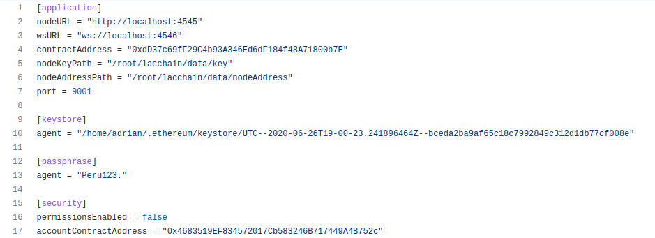

## How to adapt my contract to this new model

As the sender with which the transactions arrive at the receipient contract is the address of the RelayHub contract, a mechanism is necessary to obtain the original sender of the client or user who sent the transaction. 

To make this possible, we take advantage of the atomicity of the execution of the transactions in the EVM. That is, every time a transaction is sent to the RelayHub, the address of the original sender is stored, which is then retrieved by making a call to the RelayHub from the recipient contract.

This function to obtain the original sender is located in an abstract contract, which has to be inherited by all the contracts that will be deployed in the network.

The abstract contract to inherit is [BaseRelayRecipient](relayhub/contracts/BaseRelayRecipient.sol). After inherit this contract you have to update the value of the internal variable trustedForwarder by the address of the RelayHub contract. This address can be found in the file /lacchain/gas-relay-signer/config.toml in "contractAddress" parameter.
*(image below is a reference of config.toml)*

Next, you should use _msgSender() function instead msg.sender in all your contracts.
*(image below show you as use _msgSender() instead msg.sender)*

Finally compile your contract.

Additionally, you can find and example in [Storage2.sol](samples/contracts/BaseRelayRecipient.sol)

## How deploy a contract and send a transaction

In order to deploy or send a transaction, an end user or application that generates and signs the transaction must add two additional parameters to the function parameters of the destination contract. These parameters are as follows:

* nodeAddress(type:address): This parameter is the address of the private key that signs the transactions in the RelaySigner or by default it will be the address of the writer node through which the transactions will be sent. By default nodeAddress value is located in /lacchain/data/nodeAddress

* expiration(type:uint256): This parameter is the timestamp (Unix timestamp) that determines until when the transaction can be executed, after this time the transaction cannot be executed (added in a block).

### Deploy a contract

To deploy a contract is necessary add nodeAddress and expiration time as additional parameters at end of bytecode to deploy. An example can be find [here](samples/deployPublicSmartContract.js).

### Send a transaction
In the same way, to send a transaction it is necessary to add the two parameters at the end of the transaction so that they are part of the RLP. An example can be found [here](samples/changeSmartContractState.js)
